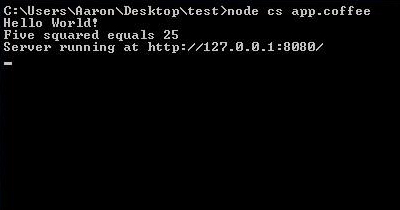

Node_CS 
=======

**Example for CoffeeScript file with .coffee or .js modules:**

`$ node cs app.coffee`

**Example for JavaScript file with .coffee or .js modules:**

`$ node cs app.js`

**Console output for app.coffee**

